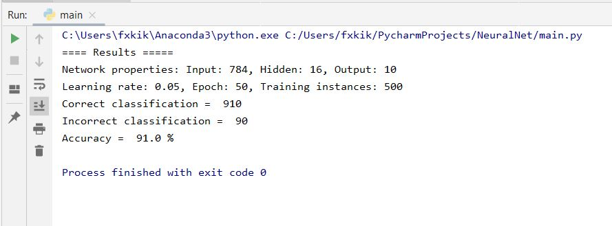

# Neural_Network

Given an input that represents pixels in an image of a number between o to 9 inclusive, this neural network tries to predict what number the image holds using the backpropagation algorithm. The input fed to the network is a list of all the pixels making up the picture (784 numbers). The input gets sent to one hidden layer in the network, and from the hidden layer to return a list of ten output, where the index (0-1) of the maximum output is the number that the network thinks the image is holding.
This is known as the MNIST dataset, and you can learn more about it <a href = "http://yann.lecun.com/exdb/mnist/">here</a>.

For training the network, I used only one hidden layer with 16 nodes, and I fed the network 5000 instances of data, and I repeated that 75 times (epoch) with a learning rate of 0.05. For testing the model, I used 10000 instances of new data for testing and calculated the accuracy of the classification: 

<b>Trials and errors</b>

I made several mistakes and learned a lot as I was building this program. First, implementing the network with a dictionary holding the weights is an approach that requires a good amount of attention. First time I ran this, I was getting around 10% accuracy as my network was merely guessing the target output since my implementation had some bugs. After fixing the bugs and testing the backpropagation algorithm on a different and smaller dataset (for which I knew the optimal weights), I realized that I was getting everything correct. Then I decided that I would get back to test my initial problem but only to find out a 9% accuracy printed to the console. The problem was I trained it with a small dataset of 500 instances and tested on 100 instances, and it was not enough to minimize the error in the weight update (using gradient descent). So, I increased the training instances to 5000 with 50 epochs (repetition) and tested the model on 1000 instances and finally got an accuracy of 91%.. 

Then I changed the epochs from 50 to 75 and increased the testing instances to 10,000 and I got the results shown above.

### What I learned:
  
    Artificial Neural networks
    Backpropagation
    
